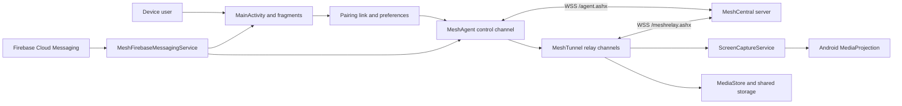

# MeshCentral Android Agent: Repository Overview

This document describes the current repository as a starting point for future
development. It is based on the implementation in the repository, not only on
the intended product behavior.

## Purpose

The app enrolls an Android device into a MeshCentral server and exposes a
mobile-specific subset of the MeshCentral agent protocol. Its main capabilities
are:

- Pairing with a MeshCentral server by QR code, `mc://` deep link, or manual
  pairing-link entry.
- Maintaining an authenticated WebSocket connection to the server.
- Reporting device, network, storage, and battery information.
- Sharing the display through Android's MediaProjection API after user consent,
  or automatically when the automatic-consent preference is enabled.
- Browsing and transferring images, audio, video, and files that Android makes
  available to the app.
- Receiving Firebase Cloud Messaging (FCM) notifications and limited console
  commands.
- Approving or rejecting MeshCentral push-based two-factor authentication
  requests.

The remote desktop implementation is currently **view only**. Protocol handlers
for keyboard, mouse, Unicode key, and input-lock messages exist, but they are
no-ops. This app does not currently provide general remote input control.

## Project Snapshot

| Item | Current value |
| --- | --- |
| Project type | Single-module Android application, Kotlin and XML views |
| Module | `app` |
| Application ID | `com.meshcentral.agent2` |
| Kotlin namespace | `com.meshcentral.agent` |
| Minimum Android SDK | 23 (Android 6.0) |
| Compile/target SDK | 35 (Android 15) |
| Version | `1.0.22` (`versionCode` 29) |
| Kotlin | 1.9.10 |
| Android Gradle Plugin | 8.6.1 |
| Gradle wrapper | 8.7 |
| Java/Kotlin target | JVM 17 |

The package namespace and installed application ID intentionally differ in the
current build configuration. Keep that distinction in mind when working with
Firebase configuration, manifests, or package-sensitive integrations.

## High-Level Architecture



This is a compact, stateful application rather than a layered Android
architecture. `MainActivity.kt` declares process-wide top-level variables for
the active activity, fragments, server link, agent, tunnels, screen-capture
service, desktop settings, and pending 2FA request. The principal classes refer
to this shared state directly.

## Main Components

### Activity and UI

- `MainActivity.kt` is the application coordinator. It loads pairing data,
  generates or loads the agent identity, requests runtime permissions, starts
  and stops the agent, manages reconnect behavior, launches MediaProjection,
  displays local alerts/notifications, and applies settings.
- `MainFragment.kt` is the home/status screen. It shows pairing and connection
  state, server branding, and users with active tunnel sessions.
- `ScannerFragment.kt` scans and validates `mc://` pairing QR codes. Pairing can
  also be entered manually or received through the manifest's `mc` deep-link
  intent filter.
- `AuthFragment.kt` displays a decoded 2FA code with approve and reject actions.
  Requests expire after approximately 60 seconds.
- `SettingsFragment.kt` exposes automatic connection and automatic screen-share
  consent preferences.
- `WebViewFragment.kt` provides an in-app browser used by the `openurl` console
  command. A separate `openbrowser` command launches the system browser.
- `nav_graph.xml` defines navigation from the home screen to scanner, browser,
  authentication, and settings screens.

### Agent Control Channel

`MeshAgent.kt` owns the long-lived control connection to
`wss://<server>/agent.ashx` using OkHttp. Its state values are:

| State | Meaning |
| --- | --- |
| 0 | Disconnected |
| 1 | Connecting |
| 2 | Authenticating |
| 3 | Connected and authenticated |

The handshake uses a locally generated 2048-bit RSA key pair and self-signed
X.509 certificate. The app exchanges nonces, validates the server identity from
the pairing link, signs the handshake, and then sends Android agent metadata and
capabilities. Once connected, the control channel:

- Sends device core information, FCM token, network state, and battery state.
- Responds to system-information and network-information requests.
- Handles server pings, branding, user images, console commands, and relay
  tunnel requests.
- Writes activity events back to the MeshCentral server.
- Sends a keepalive or network update every two minutes.

The connection advertises MeshCentral capabilities for files and console access
in addition to the mobile/desktop-view capability.

### Relay Tunnels

`MeshTunnel.kt` creates a separate pinned WebSocket for each MeshCentral relay
session. Implemented tunnel usages are:

- **Usage 2, remote desktop:** negotiates display settings and streams screen
  images. Remote keyboard and pointer command cases are recognized but ignored.
- **Usage 5, files:** lists shared storage and MediaStore collections, accepts
  uploads, and handles deletion. Modern Android deletion can invoke the system's
  recoverable-security consent flow.
- **Usage 10, file transfer:** streams a selected file from shared storage or a
  MediaStore collection to the server.

The virtual roots presented to MeshCentral are `Sdcard`, `Images`, `Audio`, and
`Videos`. Behavior differs across Android versions because Android 10 and later
use scoped MediaStore APIs while older versions use public storage paths.

### Screen Capture

`ScreenCaptureService.kt` is a foreground service with the `mediaProjection`
service type. The flow is:

1. A remote desktop tunnel requests display sharing.
2. Unless a projection is already active, `MainActivity` launches Android's
   MediaProjection consent UI.
3. On approval, the service creates a virtual display and `ImageReader`.
4. Frames are divided into 64 by 64 pixel tiles and compared using Adler-32
   values.
5. Changed tile regions are sent; if at least 85% of tiles changed, the whole
   frame is sent.
6. Images are encoded as JPEG by default, with PNG and WebP protocol options.
   The server can also adjust quality, scaling, and frame-rate settings.

Captured data is broadcast to all connected remote-desktop tunnels. Capture is
stopped when the user stops it, the agent disconnects, or no desktop tunnel
remains.

### Push Notifications and 2FA

`MeshFirebaseMessagingService.kt` receives FCM tokens and messages. Incoming
messages are accepted only after their abbreviated server hash matches the
stored pairing link. Depending on payload, the service can:

- Route a `2fa://` URL to the approval UI.
- Ask `MainActivity` to show a standard Android notification, optionally with a
  URL action.
- Process a limited push console command set (`flash`, `netinfo`, `sysinfo`, and
  `vibrate`) and send a response through FCM.

For 2FA, `AuthFragment` extracts and Base64-decodes the `code` query parameter.
The user's decision is sent over the authenticated control WebSocket by
`MeshAgent.send2faAuth`.

### Console Commands

The connected agent channel supports commands for:

- Local UI: `alert`, `toast`, `openurl`, `openbrowser`, `uiclose`, and `uistate`.
- Device actions: `dial`, `flash`, and `vibrate`.
- Inspection: `battery`, `netinfo`, `storageinfo`, and `sysinfo`.
- Agent operations: `kvmstart`, `kvmstop`, `serverlog`, and `help`.

Commands and relevant actions are logged back to the server. Some actions open
Android UI or require an active activity and therefore are not silent background
management operations.

## Important Data Flows

### Pairing and Connection

1. The user supplies an `mc://host,serverHash,deviceGroupId` link.
2. The link is stored as `qrmsh` in the `meshagent` SharedPreferences file.
3. On first connection, the app generates an RSA identity certificate and key,
   then stores them as Base64 strings in the same preferences file.
4. `MeshAgent` connects to `/agent.ashx` and authenticates both sides using the
   pairing data, TLS certificate hash, nonces, and signatures.
5. After authentication, the device reports metadata and waits for commands or
   relay requests.

The build also supports a source-level `hardCodedServerLink`. When populated,
users cannot replace or clear the configured server.

### Remote Desktop

1. The server asks the control channel to create a relay tunnel.
2. A usage-2 tunnel requests MediaProjection if capture is not already active.
3. Android obtains explicit user consent unless automatic consent is enabled and
   a reusable projection can be started by the current app state.
4. `ScreenCaptureService` sends changed image regions through every active
   desktop tunnel.

### Media and File Access

1. A usage-5 tunnel lists virtual media roots or a requested directory.
2. Downloads use a usage-10 tunnel and stream the selected content.
3. Uploads write through MediaStore on Android 10+ for supported media types, or
   to public storage on older Android versions.
4. Deletions may require Android's per-item confirmation UI.

## Storage and Process State

Persistent state is split between two SharedPreferences stores:

- `meshagent`: pairing link, agent certificate, and private key.
- Default preferences: automatic connection and automatic consent flags.

Most live state is held in process-wide Kotlin variables. There is no database,
repository layer, dependency injection container, or persistent background work
scheduler. A process restart reconstructs state from preferences and FCM, then
reconnects only when the current settings and Android lifecycle permit it.

## Android Permissions and Services

The manifest declares:

- Network and device actions: `INTERNET`, `VIBRATE`, and `CAMERA`.
- Notifications: `POST_NOTIFICATIONS`.
- Media access on Android 13+: `READ_MEDIA_IMAGES`, `READ_MEDIA_AUDIO`, and
  `READ_MEDIA_VIDEO`.
- Legacy shared storage: `READ_EXTERNAL_STORAGE` and `WRITE_EXTERNAL_STORAGE`,
  with legacy external-storage behavior requested by the application.
- Screen capture: `FOREGROUND_SERVICE` and
  `FOREGROUND_SERVICE_MEDIA_PROJECTION`.

The camera is optional hardware. The manifest registers `MainActivity`, the FCM
service, and `ScreenCaptureService`. It also removes Google Mobile Ads' `AD_ID`
permission during manifest merging.

## Dependencies

The main external dependencies are:

- AndroidX AppCompat, Core KTX, Navigation, Lifecycle, Preference, and legacy
  support libraries.
- Material Components and ConstraintLayout for the UI.
- OkHttp for control and relay WebSockets.
- Spongy Castle for certificate generation and cryptographic operations.
- Firebase Messaging and Installations-related support for push delivery.
- Code Scanner 2.3.2 (from JitPack) for QR decoding.
- Dexter for runtime permission flows.

Some declared lifecycle dependencies are not central to the current global-state
architecture. WebRTC and WorkManager dependencies are present only as commented
experiments.

## Source Layout

```text
app/
  build.gradle                         Android module configuration
  google-services.json                 Firebase application configuration
  proguard-rules.pro                   Release shrinker rules
  src/main/
    AndroidManifest.xml                Permissions, activity, and services
    java/com/meshcentral/agent/
      MainActivity.kt                  App lifecycle and coordinator
      MainFragment.kt                  Home and connection status
      ScannerFragment.kt               QR pairing
      AuthFragment.kt                  2FA approval
      SettingsFragment.kt              Preference screen
      WebViewFragment.kt               In-app browser
      MeshAgent.kt                     Authenticated control channel
      MeshTunnel.kt                    Desktop/file relay channels
      ScreenCaptureService.kt          MediaProjection screen encoder
      MeshFirebaseMessagingService.kt  FCM handling
      NotificationUtils.kt             Foreground-service notification
    res/                               Layouts, navigation, strings, themes, icons
```

## Building and Verification

Use JDK 17 or Android Studio's bundled JDK 21 for the current Android Gradle
Plugin 8.6.1 and Gradle 8.7 combination. Confirm that `JAVA_HOME` and
`java -version` select one of those JDKs before building. Java 24 is not
supported by this wrapper and fails during Gradle settings evaluation with
`Unsupported class file major version 68`.

From the repository root on Windows:

```powershell
.\gradlew.bat assembleDebug
```

Useful related tasks include:

```powershell
.\gradlew.bat lintDebug
.\gradlew.bat clean
```

The repository currently has no active unit or instrumentation test dependencies
and no test source tree. The test declarations in `app/build.gradle` are
commented out, so changes currently rely on compilation, lint, and manual testing
against Android devices and a MeshCentral server.

For device-level verification, exercise at least:

- QR, manual, and deep-link pairing.
- First connection and reconnection after process restart.
- Screen-share grant, denial, rotation, quality changes, and disconnect.
- Media listing, upload, download, and delete on both scoped-storage and legacy
  Android versions.
- Foreground/background notification and 2FA delivery.
- Notification, camera, media, and MediaProjection permission denial.

## Maintenance Considerations

These are current implementation characteristics to review before broad changes,
not a complete security audit:

- **Trust model:** the control client bypasses the platform CA and hostname
  checks, then validates identity inside the MeshCentral handshake using hashes
  from the pairing link. Relay tunnels similarly use explicit certificate-hash
  checks. Changes to this code must preserve protocol pinning and fail closed.
- **Identity storage:** the agent private key and pairing data are stored in plain
  SharedPreferences rather than Android Keystore or encrypted preferences.
- **Global mutable state:** activities, fragments, services, agent state, and 2FA
  data are held in global variables. This makes behavior sensitive to Android
  process death, activity recreation, and concurrent callbacks.
- **Lifecycle/background limits:** the control connection is owned by activity-led
  process state rather than a dedicated persistent agent service. Modern Android
  background restrictions should be tested explicitly.
- **Storage compatibility:** the code spans legacy filesystem access and scoped
  MediaStore access. Permission and URI behavior varies significantly by Android
  release.
- **Remote-desktop scope:** display capture is implemented, but remote input is
  intentionally absent in the current handlers.
- **Release signing:** the release build currently uses the debug signing
  configuration. Production release signing should be supplied outside source
  control.
- **Repository hygiene:** `app/release/app-release.aab` is checked into the tree.
  Decide whether release artifacts should remain versioned.
- **Dependency/repository age:** JCenter, Spongy Castle, and several dependency
  versions deserve review during toolchain updates.
- **Test coverage:** protocol parsing, pairing-link validation, state transitions,
  and media operations have no automated regression coverage.

## Suggested Starting Points for Updates

1. Establish a repeatable debug build and device smoke-test baseline.
2. Add focused tests around pairing-link parsing, protocol messages, and agent
   state transitions before restructuring lifecycle code.
3. Separate protocol/session state from Android UI references so process and
   configuration changes are easier to reason about.
4. Review identity storage, certificate validation, release signing, and logged
   data as a dedicated security task.
5. Modernize storage, permission, Firebase, and foreground-service behavior one
   Android API boundary at a time.
