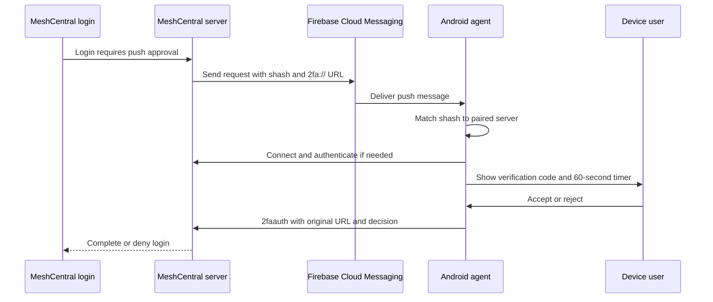

# Push Two-Factor Authentication

This document describes how push-based two-factor authentication (2FA) is
implemented in the MeshCentral Android Agent. It documents the current app
behavior; it is not a description of TOTP or SMS authentication.

## Overview

The Android agent acts as an approval device for a MeshCentral login. A
MeshCentral server sends a Firebase Cloud Messaging (FCM) request containing a
`2fa://` URL. The app displays the request's verification code and lets the
device user accept or reject it. The decision is returned to the paired server
over the agent's authenticated WebSocket connection.

The app does not generate one-time passwords and does not ask the user to type a
code. The displayed code lets the user compare the login request with the code
shown by MeshCentral before making a decision.



## Components

| Component | Responsibility |
| --- | --- |
| `MeshFirebaseMessagingService` | Receives the FCM token and incoming push messages, validates the abbreviated server hash, and routes 2FA requests. |
| `MainActivity` | Obtains the FCM token, handles an activity launched with a 2FA URL, connects the agent when necessary, and exposes notification settings. |
| `MainFragment` | Opens the authentication screen after the agent reaches the connected and authenticated state. |
| `AuthFragment` | Decodes and displays the verification code, runs the expiration timer, and handles Accept or Reject. |
| `MeshAgent` | Advertises the FCM token and sends the 2FA decision over the authenticated control channel. |

The current implementation keeps the pending request in the process-wide
`g_auth_url` variable. It is not written to preferences or a database.

## Registering the Device for Push Requests

On startup, `MainActivity` asks Firebase Messaging for the current registration
token and stores it in the process-wide `pushMessagingToken` variable. Firebase
can rotate this token; `MeshFirebaseMessagingService.onNewToken` updates the
same variable when that happens.

After the MeshCentral control channel is authenticated, `MeshAgent.sendCoreInfo`
sends a `coreinfo` message. When a token is available, the message includes it
in the `pmt` field:

```json
{
  "action": "coreinfo",
  "value": "Android Agent v<version>",
  "caps": 13,
  "pmt": "<FCM registration token>"
}
```

If Firebase rotates the token while the agent is connected,
`onNewToken` sends updated core information immediately. If the agent is not
connected, the new token is included after the next successful connection.

## Incoming Request Format and Validation

The FCM data used by the app includes these fields:

| Field | Purpose |
| --- | --- |
| `shash` | An abbreviated hash identifying the paired MeshCentral server. It must contain at least 12 characters. |
| `url` | The opaque 2FA request URL. For this flow it starts with `2fa://`. |

The URL contains a `code` query parameter. `AuthFragment` Base64-decodes this
parameter as UTF-8 and displays the resulting text as the verification code.
For example, the shape of a request is:

```text
2fa://...?code=<Base64-encoded verification code>&...
```

The app does not parse the other URL fields. It preserves the complete original
URL and returns it to the server with the user's decision.

Before processing any FCM message, the service requires all of the following:

1. The app has a configured MeshCentral pairing link.
2. The message contains `shash` and it is at least 12 characters long.
3. The server-hash value in the pairing link starts with the supplied `shash`.
4. The URL starts with the case-sensitive prefix `2fa://` when handled directly by the messaging service.

A message that fails these checks is ignored. This abbreviated-hash comparison
binds the push to the configured server, while the response is sent only over
the mutually authenticated and server-pinned MeshCentral control connection.
The push payload itself is not independently signed or encrypted by application
code, so the app relies on FCM delivery plus the server-hash check for incoming
message provenance.

## Request Lifecycle

### App is active

When `MeshFirebaseMessagingService` receives a valid `2fa://` request and
`MainActivity` exists, it stores the parsed URL in `g_auth_url` on the UI thread.

- If the agent is disconnected, the activity starts a connection.
- If an agent instance already exists, the app attempts to navigate to the
  authentication screen.
- Once the agent is fully connected, `MainFragment.refreshInfo` notices the
  pending URL and opens the authentication screen if it is not already visible.

Navigation occurs only from the main screen. If another screen is visible when
the push arrives, the request remains pending until normal navigation and a
subsequent refresh allow the authentication screen to open.

### App is launched from a notification

`MainActivity.onCreate` also accepts a string extra named `url`. If that value
starts with `2fa://` (case-insensitive in this path), the activity removes the
extra, stores the parsed request, and connects or opens the authentication
screen as above. This supports an FCM notification that launches the activity
with its data fields.

Direct service handling does not create a local notification for a 2FA data
message when no `MainActivity` instance exists. Background and terminated-app
behavior therefore depends on the server sending an FCM notification payload
that Android can display and that supplies the `url` extra when opened.

### User confirmation

`AuthFragment` shows:

- A Base64-decoded verification code, or `000000` when the URL or code is absent.
- An Accept button.
- A Reject button.
- A progress bar driven by a 60-second `CountDownTimer`.

The user should compare the displayed code with the code shown in the
MeshCentral login before accepting.

Accept and Reject both send a response when the agent and pending URL are still
available, clear `g_auth_url`, cancel the timer, and return to the main screen.
The response JSON is:

```json
{
  "action": "2faauth",
  "url": "<complete original 2fa:// URL>",
  "approved": true
}
```

`approved` is `true` for Accept and `false` for Reject. The message is sent on
`/agent.ashx` through the current authenticated WebSocket.

## Expiration and Connection Behavior

The authentication screen closes after 60 seconds. A local timeout does not
send an explicit rejection and does not clear `g_auth_url`; the server is
expected to enforce the request's validity period. A later main-screen refresh
may therefore reopen the still-pending request until it is replaced, accepted,
rejected, or the app process ends.

If the control connection enters a disconnected, connecting, or authenticating
state while the approval screen is visible, `MainFragment` closes the screen.
After authentication succeeds, the pending request can be shown again. A user
decision is sent only when a `MeshAgent` and pending URL are both present.

Only one request can be pending. A newly received request overwrites the value
in `g_auth_url`; there is no request queue or persistent recovery after process
death.

## Android Notification Permission

The manifest declares `POST_NOTIFICATIONS`, and the app requests it on Android
13 and later with its other runtime permissions. When notifications are
disabled, the main menu exposes **Enable Push Authentication**, which opens the
app's Android notification settings.

Disabling notification display can prevent a background approval prompt from
being visible to the user. FCM token registration and data delivery are separate
from the notification permission, but Android background-delivery rules and the
server's FCM payload determine whether a request reaches or visibly alerts a
terminated or backgrounded app.

## Security and Operational Notes

- Pairing must be complete before a push request is accepted.
- The verification code is display-only; approval is the Boolean response sent
  with the opaque original URL.
- The response uses the authenticated, certificate-pinned agent channel rather
  than FCM.
- The app does not apply biometric authentication, a device credential check,
  or a second local confirmation before Accept.
- The pending URL and decoded code exist in process memory and are not persisted.
- The app logs incoming FCM metadata with `println`, including the message data;
  production logging should be reviewed if the 2FA URL is considered sensitive.
- Request expiration is primarily server-enforced. The local 60-second timer is
  a UI timeout, not a cryptographic validity check.

## Relevant Source Files

- `app/src/main/java/com/meshcentral/agent/MeshFirebaseMessagingService.kt`
- `app/src/main/java/com/meshcentral/agent/MainActivity.kt`
- `app/src/main/java/com/meshcentral/agent/MainFragment.kt`
- `app/src/main/java/com/meshcentral/agent/AuthFragment.kt`
- `app/src/main/java/com/meshcentral/agent/MeshAgent.kt`
- `app/src/main/res/layout/fragment_auth.xml`
- `app/src/main/AndroidManifest.xml`
